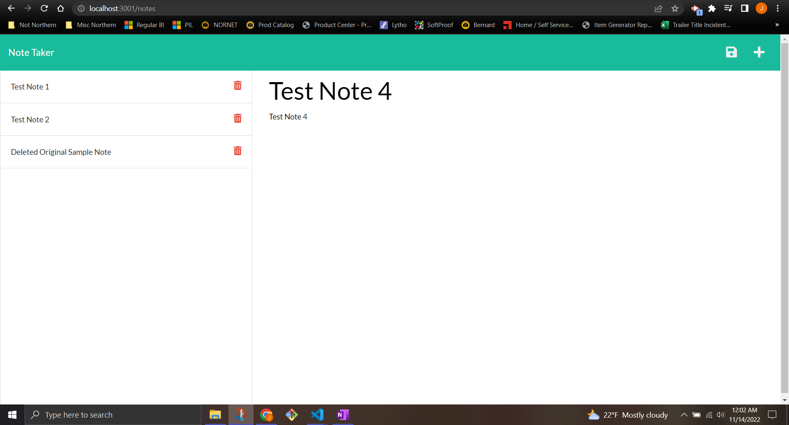

# 11 Note Taker Starter Code

## <strong>Description</strong>

For Module 11, we are tasked with creating a Note Taking app

## <strong>Acceptance Criteria</strong>

    GIVEN a note-taking application
    WHEN I open the Note Taker
    THEN I am presented with a landing page with a link to a notes page
    WHEN I click on the link to the notes page
    THEN I am presented with a page with existing notes listed in the left-hand column, plus empty fields to enter a new note title and the note’s text in the right-hand column
    WHEN I enter a new note title and the note’s text
    THEN a Save icon appears in the navigation at the top of the page
    WHEN I click on the Save icon
    THEN the new note I have entered is saved and appears in the left-hand column with the other existing notes
    WHEN I click on an existing note in the list in the left-hand column
    THEN that note appears in the right-hand column
    WHEN I click on the Write icon in the navigation at the top of the page
    THEN I am presented with empty fields to enter a new note title and the note’s text in the right-hand column

## <strong>Criteria Met</strong>

♦ Landing page with link to notes created

♦ Left Hand column lists notes

♦ New note title shows new note text to enter

♦ Save icon saves document

♦ Clicking on Write icon presents empty fields

♦ added https://www.uuidgenerator.net/version4 per suggestion of Ben Binder in class Slack messenger ♦ 

### <strong>Website Link</strong>

https://github.com/FleischmanJ88/11-HandyDandyNotebook

### <strong>Screenshot</strong>

### <strong>Contact Information</strong>

https://github.com/FleischmanJ88